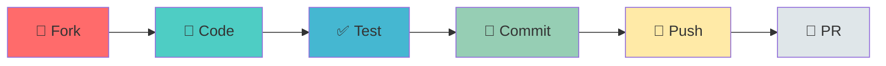
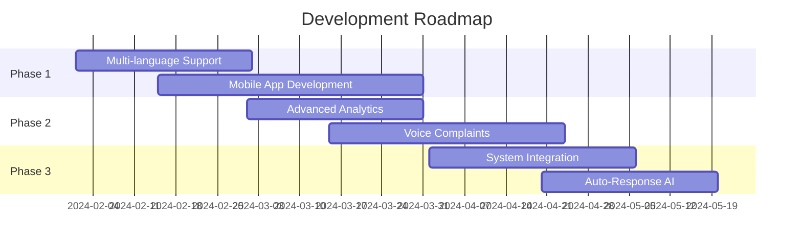

<div align="center">

# 🚀 Sahayata-Setu

### *Transforming Complaint Management with AI Intelligence*


[](https://sahayata-setu.vercel.app/)
[](https://sahayata-setu-apis.vercel.app)
[](LICENSE)
[](https://github.com/Priyanshu-Baghel/Prayatana-2.0/stargazers)


---

### 💫 *Where AI Meets Efficiency*

</div>

## 🎯 What is Sahayata-Setu?

<table>
<tr>
<td width="50%">

### 🌟 **The Problem**
Traditional complaint systems are:
- ❌ Slow and inefficient
- ❌ Manual prioritization errors
- ❌ Critical issues get buried
- ❌ Poor user experience
- ❌ No intelligent routing

</td>
<td width="50%">

### ✨ **Our Solution**
Sahayata-Setu brings:
- ✅ AI-powered sentiment analysis
- ✅ Automatic priority detection
- ✅ Instant complaint routing
- ✅ Real-time status tracking
- ✅ Smart categorization

</td>
</tr>
</table>

<div align="center">

## 🎨 **Key Features**

</div>

<table>
<tr>
<td align="center" width="33%">


### 🤖 **AI Intelligence**
Powered by **Llama 3.2**
- Sentiment Analysis
- Urgency Detection
- Auto-Categorization
- Pattern Recognition

</td>
<td align="center" width="33%">


### ⚡ **Lightning Fast**
Real-Time Processing
- Instant Analysis
- Quick Routing
- Live Updates
- Rapid Resolution

</td>
<td align="center" width="33%">


### 📊 **Smart Dashboard**
Powerful Analytics
- Visual Insights
- Performance Metrics
- Trend Analysis
- Custom Reports

</td>
</tr>
</table>

---

<div align="center">

## 🛠️ **Tech Arsenal**


</div>

### 🎨 **Frontend Magic**
```yaml
⚛️  React.js:        Modern UI Framework
⚡  Vite:            Lightning-fast Build Tool
🎨  Tailwind CSS:    Utility-First Styling
🔄  React Router:    Seamless Navigation
📡  Axios:           HTTP Client
```

### 🔧 **Backend Power**
```yaml
🟢  Node.js:         JavaScript Runtime
🚂  Express.js:      Web Framework
🐍  Flask:           Python Microframework
🍃  MongoDB:         NoSQL Database
🔐  JWT:             Secure Authentication
```

### 🤖 **AI Engine**
```yaml
🧠  Llama 3.2:       Advanced Language Model
📊  NLP:             Natural Language Processing
🎯  Sentiment AI:    Emotion Detection
⚖️   Priority Score:  Urgency Calculation
```

---

<div align="center">

## 🚀 **Quick Start Guide**

</div>

### 📋 **Prerequisites**

<table>
<tr>
<td align="center"><br/><b>Node.js 16+</b></td>
<td align="center"><br/><b>Python 3.8+</b></td>
<td align="center"><br/><b>MongoDB</b></td>
<td align="center"><br/><b>npm/yarn</b></td>
</tr>
</table>

### 💻 **Installation Steps**

<details>
<summary><b>🎨 Frontend Setup</b> (Click to expand)</summary>

```bash
# 📂 Navigate to client directory
cd client

# 📦 Install dependencies
npm install

# 🔧 Configure environment
cp .env.example .env
# Add: VITE_API_URL=http://localhost:5000

# 🚀 Launch development server
npm run dev

# ✨ Open http://localhost:5173
```

**🎉 Frontend is Live!**

</details>

<details>
<summary><b>⚙️ Backend Setup (Node.js)</b> (Click to expand)</summary>

```bash
# 📂 Navigate to server directory
cd server

# 📦 Install dependencies
npm install

# 🔧 Configure environment
cp .env.example .env
# Add your MongoDB URI, JWT secret, etc.

# 🚀 Start the server
npm run dev

# ✨ API running on http://localhost:5000
```

**🎉 Backend is Ready!**

</details>

<details>
<summary><b>🤖 AI Service Setup (Flask)</b> (Click to expand)</summary>

```bash
# 📂 Navigate to AI service directory
cd apis

# 🐍 Create virtual environment
python -m venv venv

# ⚡ Activate environment
# Windows: venv\Scripts\activate
# Mac/Linux: source venv/bin/activate

# 📦 Install AI dependencies
pip install -r requirements.txt

# 🔧 Configure environment
cp .env.example .env
# Add your SOLO API key

# 🚀 Launch AI service
python app.py

# ✨ AI service on http://localhost:5001
```

**🎉 AI Engine is Active!**

</details>

---

<div align="center">

## 📁 **Project Architecture**

</div>

```
🌳 Prayatana-2.0/
│
├── 🎨 client/                    # React Frontend
│   ├── 📦 src/
│   │   ├── 🧩 components/        # UI Components
│   │   ├── 📄 pages/             # Route Pages
│   │   ├── 🛠️ utils/             # Helpers
│   │   ├── 🖼️ assets/            # Media Files
│   │   └── ⚛️ App.jsx            # Root Component
│   └── 📋 package.json
│
├── ⚙️ server/                    # Node.js Backend
│   ├── 🎮 controllers/           # Logic Handlers
│   ├── 📊 models/                # DB Schemas
│   ├── 🛣️ routes/                # API Routes
│   ├── 🛡️ middleware/            # Auth & Guards
│   └── 🚀 server.js              # Entry Point
│
├── 🤖 apis/                      # Flask AI Service
│   ├── 📤 uploads/               # File Storage
│   ├── 🧠 models/                # AI Models
│   ├── 🔧 utils/                 # Utilities
│   └── 🐍 app.py                 # Flask App
│
├── 📜 LICENSE
└── 📖 README.md
```

---

<div align="center">

## 🎮 **API Playground**

</div>

### 🔗 **Base URLs**
```
🏠 Development:  http://localhost:5000/api
🌐 Production:   https://sahayata-setu-apis.vercel.app/api
```

### 📡 **Core Endpoints**

<table>
<tr>
<th>Category</th>
<th>Method</th>
<th>Endpoint</th>
<th>Description</th>
</tr>
<tr>
<td rowspan="3">🔐 <b>Auth</b></td>
<td><code>POST</code></td>
<td><code>/auth/register</code></td>
<td>Register new user</td>
</tr>
<tr>
<td><code>POST</code></td>
<td><code>/auth/login</code></td>
<td>User login</td>
</tr>
<tr>
<td><code>POST</code></td>
<td><code>/auth/logout</code></td>
<td>User logout</td>
</tr>
<tr>
<td rowspan="5">📝 <b>Complaints</b></td>
<td><code>POST</code></td>
<td><code>/complaints</code></td>
<td>Submit complaint</td>
</tr>
<tr>
<td><code>GET</code></td>
<td><code>/complaints</code></td>
<td>List all complaints</td>
</tr>
<tr>
<td><code>GET</code></td>
<td><code>/complaints/:id</code></td>
<td>Get complaint details</td>
</tr>
<tr>
<td><code>PUT</code></td>
<td><code>/complaints/:id</code></td>
<td>Update complaint</td>
</tr>
<tr>
<td><code>DELETE</code></td>
<td><code>/complaints/:id</code></td>
<td>Delete complaint</td>
</tr>
<tr>
<td rowspan="2">🤖 <b>AI Analysis</b></td>
<td><code>POST</code></td>
<td><code>/analyze/sentiment</code></td>
<td>Analyze sentiment</td>
</tr>
<tr>
<td><code>POST</code></td>
<td><code>/analyze/priority</code></td>
<td>Calculate priority</td>
</tr>
</table>

---

<div align="center">

## 🤝 **Join the Revolution**

### *Every Contribution Counts!*

</div>



### 🌟 **How to Contribute**

1. **🍴 Fork** the repository
2. **🌿 Create** your feature branch
   ```bash
   git checkout -b feature/AmazingFeature
   ```
3. **💬 Commit** your changes
   ```bash
   git commit -m '✨ Add some AmazingFeature'
   ```
4. **🚀 Push** to the branch
   ```bash
   git push origin feature/AmazingFeature
   ```
5. **🎁 Open** a Pull Request

<div align="center">

### 💎 **Contribution Guidelines**

| Do's ✅ | Don'ts ❌ |
|---------|-----------|
| Follow code style | Break existing features |
| Write meaningful commits | Submit incomplete work |
| Add tests | Ignore PR template |
| Update docs | Skip code reviews |

</div>

---

<div align="center">

## 🗺️ **Roadmap to Excellence**

</div>



### 🎯 **Upcoming Features**

<table>
<tr>
<td>

#### 🔜 **Phase 1** (Q1 2024)
- [ ] 🌍 Multi-language Support
- [ ] 📱 Native Mobile Apps
- [ ] 🎨 UI/UX Revamp
- [ ] 🔔 Push Notifications

</td>
<td>

#### 🚀 **Phase 2** (Q2 2024)
- [ ] 📊 Advanced Analytics
- [ ] 🎤 Voice Complaints
- [ ] 📧 Email Integration
- [ ] 🤖 Chatbot Support

</td>
<td>

#### 💫 **Phase 3** (Q3 2024)
- [ ] 🔗 Third-party APIs
- [ ] 💡 Auto-suggestions
- [ ] 📈 Predictive Analytics
- [ ] 🌐 Multi-tenant Support

</td>
</tr>
</table>

---

<div align="center">

## 🏆 **Achievements**


</div>

---

<div align="center">

## 📜 **License**


**MIT License** - Feel free to use this project for your own purposes

See [LICENSE](LICENSE) for more details

</div>

---

<div align="center">

## 🙏 **Acknowledgments**

<table>
<tr>
<td align="center">
<br/>
<b>Meta AI</b><br/>
<sub>Llama 3.2 Model</sub>
</td>
<td align="center">
<br/>
<b>Solo</b><br/>
<sub>AI Integration</sub>
</td>
<td align="center">
<br/>
<b>Contributors</b><br/>
<sub>Amazing Community</sub>
</td>
<td align="center">
<br/>
<b>Open Source</b><br/>
<sub>Community Support</sub>
</td>
</tr>
</table>

</div>

---

<div align="center">

## 📞 **Get in Touch**

<a href="https://github.com/Priyanshu-Baghel/Prayatana-2.0/issues">

</a>
<a href="https://github.com/Priyanshu-Baghel/Prayatana-2.0/discussions">

</a>

### 💡 **Have Questions?**

- 📧 **Email**: Open an issue for support
- 💭 **Discussions**: Join our community
- 📚 **Docs**: Check our [Wiki](https://github.com/Priyanshu-Baghel/Prayatana-2.0/wiki)
- 🐦 **Updates**: Follow the repository

</div>

---

<div align="center">

## 💖 **Show Your Support**


**If you like this project, please consider:**

⭐ Starring the repository<br/>
🍴 Forking for your own use<br/>
🐛 Reporting bugs<br/>
💡 Suggesting new features<br/>
📢 Sharing with others

<br/>

### 🌟 **Star History**

[](https://star-history.com/#Priyanshu-Baghel/Prayatana-2.0&Date)

<br/>


### **Made with ❤️ for Better Governance**

*Empowering Citizens • Streamlining Services • Building Trust*


<br/>

**© 2024 Sahayata-Setu. All Rights Reserved.**

<br/>

[](https://visitorbadge.io/status?path=Priyanshu-Baghel%2FPrayatana-2.0)

</div>
